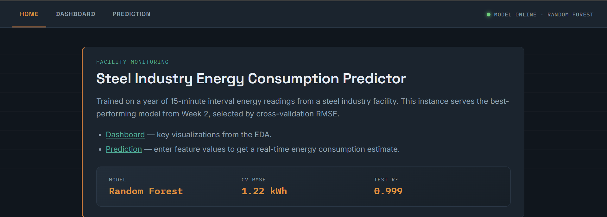
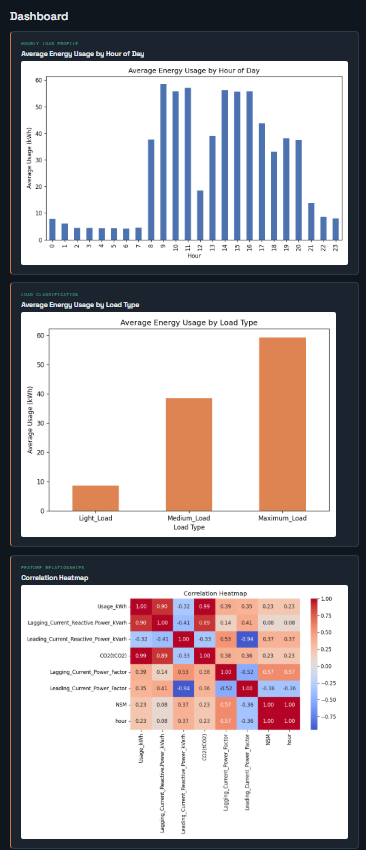
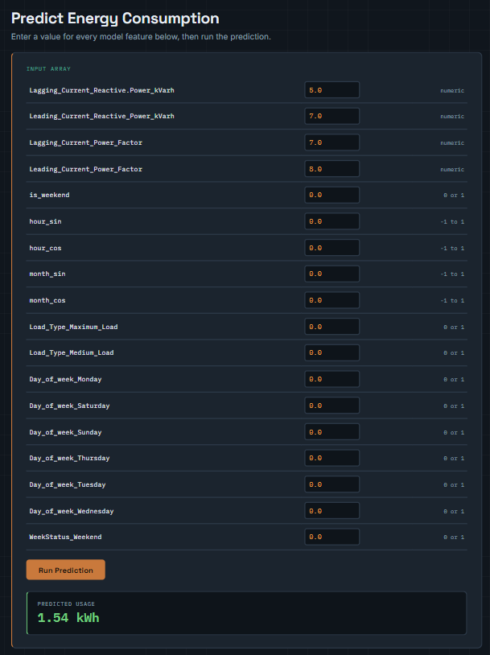

# Steel Industry Energy Consumption — Prediction, Dimensionality Reduction & Deployment

An end-to-end machine learning project that predicts 15-minute interval energy consumption (`Usage_kWh`) for a steel industry facility. The project covers EDA, leakage-aware preprocessing, model benchmarking with time-series-correct validation, PCA-based dimensionality reduction, and deployment via a FastAPI dashboard with real-time prediction.

---

## Table of Contents
- [Project Overview](#project-overview)
- [Repository Structure](#repository-structure)
- [Dataset Information](#dataset-information)
- [Environment Setup](#environment-setup)
- [Feature Engineering](#feature-engineering)
- [EDA Findings](#eda-findings)
- [Model Training Process](#model-training-process)
- [Dimensionality Reduction (PCA)](#dimensionality-reduction-pca)
- [Results and Conclusions](#results-and-conclusions)
- [FastAPI Dashboard](#fastapi-dashboard)
- [Screenshots](#screenshots)
- [How to Run](#how-to-run)
- [Known Limitations](#known-limitations)

---

## Project Overview
The goal is to predict a steel plant's energy usage (`Usage_kWh`) from electrical load readings, time-based features, and load classification, then serve the trained model through a small web application.

The work is split across three phases:

| Week | Focus | Deliverable |
|---|---|---|
| Week 2 | EDA + preprocessing + baseline model benchmarking | `notebooks/week2_eda.ipynb`, `notebooks/week2_baseline_models.ipynb` |
| Week 3, Part 1 | PCA dimensionality reduction | `notebooks/week3_pca_dashboard.ipynb` |
| Week 3, Part 2 | FastAPI deployment + dashboard | `main.py`, `templates/`, `static/` |

The best model — a **Random Forest Regressor**, selected by cross-validated RMSE — is saved as a `joblib` pipeline and served live behind a `/predict` endpoint.

---

## Repository Structure

```text
Week 3/
├── main.py                          # FastAPI app (routes: /, /dashboard, /predict)
├── generate_dashboard_charts.py     # Generates the 3 dashboard PNGs from raw data
├── requirements.txt
├── README.md
├── data/
│   ├── Week 2 (DataSet).xlsx        # Raw dataset
│   └── images/                      # Screenshots referenced in this README
│       ├── home.png
│       ├── dashboard.png
│       └── predict.png
├── templates/
│   ├── base.html
│   ├── home.html
│   ├── dashboard.html
│   └── predict.html
├── static/
│   ├── energy_by_hour.png
│   ├── energy_by_load_type.png
│   └── correlation_heatmap.png
└── notebooks/
    ├── week2_eda.ipynb
    ├── week2_baseline_models.ipynb
    └── week3_pca_dashboard.ipynb

> **Note on trained model files:** `week2_best_model.joblib` and
> `week3_model_baseline.joblib` are not committed to this repository. They're
> generated locally by running the notebooks (see [How to Run](#how-to-run))
> and are excluded via `.gitignore`. `main.py` expects them to exist in the
> project root at runtime — run the notebooks once before starting the app.

```
---

## Dataset Information

- **Source:** UCI "Steel Industry Energy Consumption" dataset (steel plant in
  Gwangyang, South Korea).
- **File:** `data/Week 2 (DataSet).xlsx`, sheet `Steel_industry_data`
- **Size:** 35,040 rows × 11 raw columns — one row every 15 minutes across a
  full year (Jan 1, 2018 – Dec 31, 2018).
- **Target:** `Usage_kWh`
- **Raw columns:**

| Column | Description |
|---|---|
| `date` | Timestamp (15-min resolution) |
| `Usage_kWh` | Energy consumption (target) |
| `Lagging_Current_Reactive.Power_kVarh` | Reactive power (lagging) |
| `Leading_Current_Reactive_Power_kVarh` | Reactive power (leading) |
| `CO2(tCO2)` | CO₂ emissions — dropped, see [Feature Engineering](#feature-engineering) |
| `Lagging_Current_Power_Factor` | Power factor (lagging) |
| `Leading_Current_Power_Factor` | Power factor (leading) |
| `NSM` | Number of seconds from midnight — dropped, redundant with `hour` |
| `WeekStatus` | Weekday / Weekend |
| `Day_of_week` | Monday–Sunday |
| `Load_Type` | Light / Medium / Maximum load |

- **Data quality:** 0 missing values, 0 duplicate rows (verified directly
  against the raw file).

---

## Environment Setup

```bash
python -m venv venv
source venv/bin/activate        # Windows: venv\Scripts\activate
pip install -r requirements.txt
```

`requirements.txt`:
- fastapi==0.139.2
- uvicorn==0.51.0
- starlette==1.3.1
- jinja2==3.1.6
- python-multipart==0.0.32
- pandas==3.0.2
- numpy==2.4.4
- scikit-learn==1.8.0
- matplotlib==3.10.8
- seaborn==0.13.2
- openpyxl==3.1.5
- joblib==1.5.3

Tested against Python 3.12 and 3.14. If you're on an older Python and
`pip install` fails to resolve these exact pins, the two packages to relax
first are `fastapi`/`starlette` (keep them paired) and `scikit-learn`
(must match whatever version trained the saved `.joblib` files).

---

## Feature Engineering

Starting from the 11 raw columns, the following transformations are applied
(see `notebooks/week2_baseline_models.ipynb`):

1. **Datetime decomposition** — `hour` and `month` extracted from `date`.
2. **Cyclical encoding** — `hour` and `month` are cyclical (hour 23 is
   adjacent to hour 0; December is adjacent to January), so raw integers
   would impose a false linear distance. Replaced with:
   `hour_sin`, `hour_cos`, `month_sin`, `month_cos`.
3. **`is_weekend`** — binary flag derived from day of week.
4. **Leakage-aware column drops:**
   - `CO2(tCO2)` — 0.99 correlated with `Usage_kWh` (computed from it directly)
   - `NSM` — 1.00 correlated with `hour` (redundant)
   - `date`, raw `hour`, raw `month` — superseded by the engineered features above
5. **Multicollinearity check** — an initial `Power_Factor_Ratio` feature
   (Leading ÷ Lagging power factor) was tested and dropped: it correlated
   with the target at only −0.09, versus 0.35–0.39 for each raw power factor
   column individually. The ratio added collinearity without predictive
   value, so the two original power factor columns were kept instead.
6. **One-hot encoding** (`drop_first=True`) for `Load_Type`, `Day_of_week`,
   `WeekStatus` — nominal categories with no natural order.

**Final feature set (18 columns):**
`Lagging_Current_Reactive.Power_kVarh`, `Leading_Current_Reactive_Power_kVarh`,
`Lagging_Current_Power_Factor`, `Leading_Current_Power_Factor`, `is_weekend`,
`hour_sin`, `hour_cos`, `month_sin`, `month_cos`, `Load_Type_Maximum_Load`,
`Load_Type_Medium_Load`, `Day_of_week_Monday`, `Day_of_week_Saturday`,
`Day_of_week_Sunday`, `Day_of_week_Thursday`, `Day_of_week_Tuesday`,
`Day_of_week_Wednesday`, `WeekStatus_Weekend`.

---

## EDA Findings

Full analysis in `notebooks/week2_eda.ipynb`.

- **Usage by hour of day:** consumption is minimal overnight (~4–8 kWh) and
  jumps sharply during working hours (peaks ~55–59 kWh between roughly
  09:00–16:00), reflecting active production shifts.
- **Usage by load type:** clear separation — `Light_Load` averages ~9 kWh,
  `Medium_Load` ~38 kWh, `Maximum_Load` ~59 kWh.
- **Outliers:** IQR analysis on `Usage_kWh` flagged 328 outliers. These were
  deliberately **kept** — they represent genuine heavy-machinery-use periods,
  not data errors. `Usage_kWh` has a right skew of ~1.2 (median 4.57, max
  157.18), which is a relevant caveat for squared-error models like Linear
  Regression and Ridge (see below).
- **Correlation structure:** `Usage_kWh` correlates strongly with
  `Lagging_Current_Reactive.Power_kVarh` (0.90) and `CO2(tCO2)` (0.99, the
  reason it was dropped as a leakage feature). Power factor columns show
  moderate correlation (0.35–0.39). See the correlation heatmap under
  [Screenshots](#screenshots).

---

## Model Training Process

Four regression models were benchmarked in `notebooks/week2_baseline_models.ipynb`:
**Linear Regression, Ridge Regression, Decision Tree, Random Forest.**

Key methodology decisions, each made after finding a problem with a naive
first pass:

1. **Time-based train/test split, not random.** The data is 15-minute
   interval readings — adjacent rows are highly autocorrelated. An initial
   random `train_test_split` (and `KFold(shuffle=True)`) let models see
   near-duplicate timestamps in both train and test, inflating every score.
   Fixed by sorting chronologically and splitting the first 80% of the year
   for training, the last 20% for testing, and using `TimeSeriesSplit` for
   cross-validation instead of shuffled `KFold`.
2. **Feature scaling for linear models.** Ridge's penalty is scale-sensitive;
   without scaling, an initial run showed Ridge performing identically to
   plain Linear Regression, meaning the regularization wasn't doing anything.
   Fixed with a `StandardScaler` fit on the training set only, inside a
   `Pipeline`.
3. **Log-transformed target for linear models.** `Usage_kWh`'s right skew
   disproportionately influences squared-error models. Linear/Ridge use
   `TransformedTargetRegressor` with `log1p`/`expm1` so metrics stay
   interpretable on the original kWh scale. Tree models are left untransformed
   since they're robust to target skew.
4. **Model selection by cross-validated RMSE**, not single-split test RMSE,
   for a more reliable comparison.

---

## Dimensionality Reduction (PCA)

Full analysis in `notebooks/week3_pca_dashboard.ipynb`.

- `StandardScaler` and `PCA` are fit on the training set only (fitting on the
  full dataset before splitting would leak test-set variance into the
  components).
- All 18 components were computed to inspect the full variance curve.
- **13 of 18 components** are needed to reach 95% cumulative explained
  variance — PCA barely compresses this dataset, since the one-hot-encoded
  day-of-week columns each carry independent variance that doesn't collapse
  well.
- The Random Forest was retrained on (a) 3 PCA components and (b) 13 PCA
  components (95% variance), and compared against the original 18-feature
  model.

**Report conclusion:** PCA is *not* recommended for this model/dataset —
see [Results](#results-and-conclusions) for the numbers. 18 features was
never a memory or compute bottleneck to begin with, and the accuracy cost of
compressing them is too large relative to any savings.

---

## Results and Conclusions

### Baseline model comparison (Week 2, time-based split)

| Model | CV RMSE | Test RMSE | Test R² |
|---|---|---|---|
| Linear Regression | 13.804 | 15.009 | 0.802 |
| Ridge Regression | 13.805 | 15.007 | 0.802 |
| Decision Tree | 3.331 | 1.552 | 0.998 |
| **Random Forest (selected)** | **1.224** | **0.931** | **0.999** |

Random Forest was selected as the best model by cross-validated RMSE and is
the model deployed in the FastAPI app.

### PCA comparison (Week 3)

| Model | RMSE | R² | Variance retained |
|---|---|---|---|
| Original (18 features) | 0.931 | 0.999 | 100% |
| PCA — 3 components | 11.228 | 0.889 | 44.7% |
| PCA — 13 components (95%) | 7.630 | 0.949 | 95% |

**Conclusion:** Accuracy drops substantially under PCA — roughly 8–12×
worse RMSE, even at the 95% variance threshold. Variance and predictive
relevance aren't the same thing here: PCA compresses by variance, but the
Random Forest was extracting signal from directions PCA treats as low-priority
(e.g., specific day-of-week indicators). Effectively no features can be
safely removed without a real accuracy cost, and PCA is **not recommended**
for deployment on a memory-constrained device in this case — the trained
Random Forest itself (many trees, many nodes) dwarfs the memory cost of an
18-float input vector, so PCA doesn't address the actual memory bottleneck a
constrained device would face.

---

## FastAPI Dashboard

The trained pipeline is served through a small FastAPI app with three routes:

| Route | Method | Purpose |
|---|---|---|
| `/` | GET | Landing page with model summary ("nameplate") and navigation |
| `/dashboard` | GET | Three EDA visualizations rendered as static charts |
| `/predict` | GET / POST | Form with one input per model feature; returns a live prediction |

The model, scaler (if any), and PCA transform (if any) are loaded once at
startup via `joblib` and reused across requests — no retraining happens at
request time.

---

## Screenshots

**Home page**


**Dashboard — hourly usage, load type breakdown, correlation heatmap**


**Prediction form and live result**


---

## How to Run

1. **Install dependencies**
```bash
   pip install -r requirements.txt
```

2. **Run the notebooks in order** (each depends on the previous one's saved
   artifact; this also produces the `.joblib` model files, which are not
   committed to the repo):
```bash
   jupyter notebook notebooks/week2_eda.ipynb
   jupyter notebook notebooks/week2_baseline_models.ipynb   # produces week2_best_model.joblib
   jupyter notebook notebooks/week3_pca_dashboard.ipynb      # produces week3_model_baseline.joblib
```

3. **Generate the dashboard charts** (only needs to be done once, or
   whenever the dataset changes):
```bash
   python generate_dashboard_charts.py
```

4. **Start the app:**
```bash
   uvicorn main:app --reload
```
   Then open `http://127.0.0.1:8000/` and check `/`, `/dashboard`, and
   `/predict`.

   Note: run `uvicorn`, not `python main.py` — `main.py` only defines the
   FastAPI `app` object and has no built-in server startup block.

---
