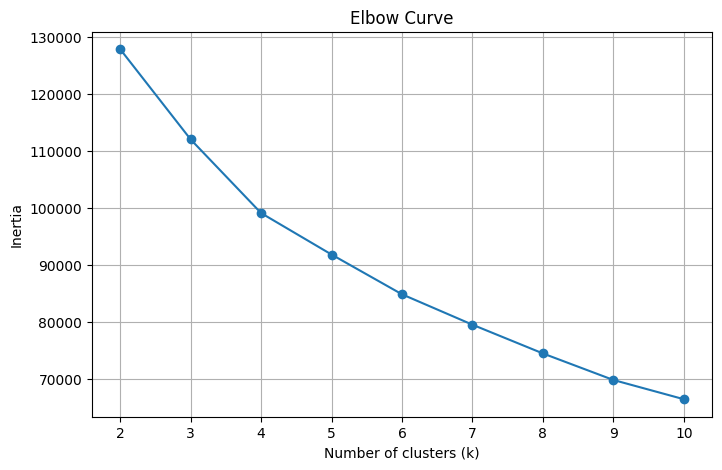
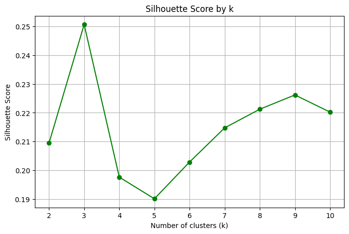
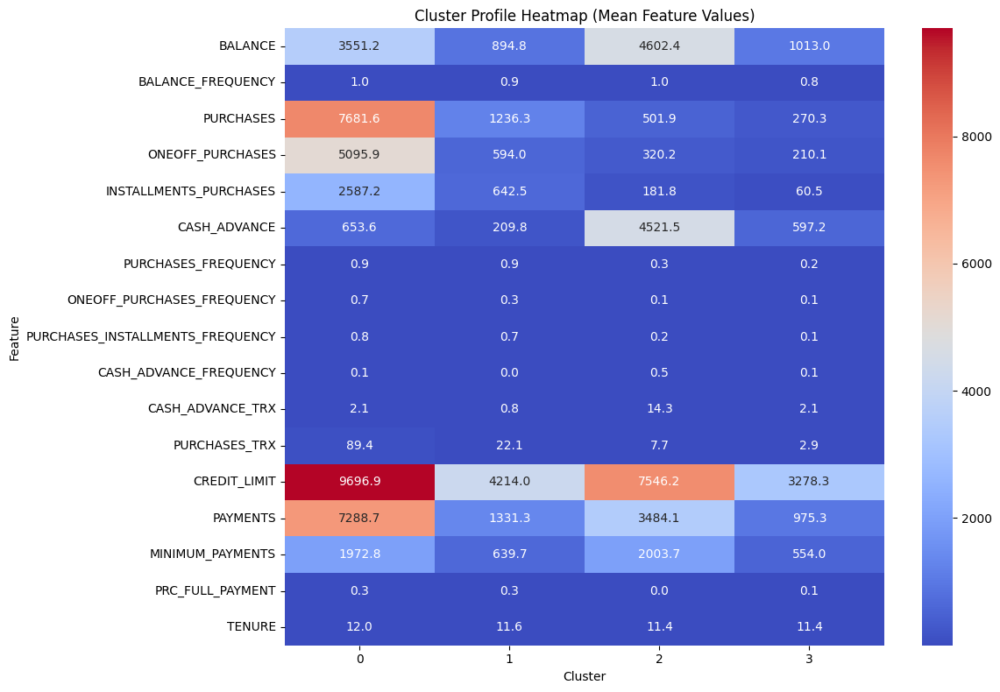
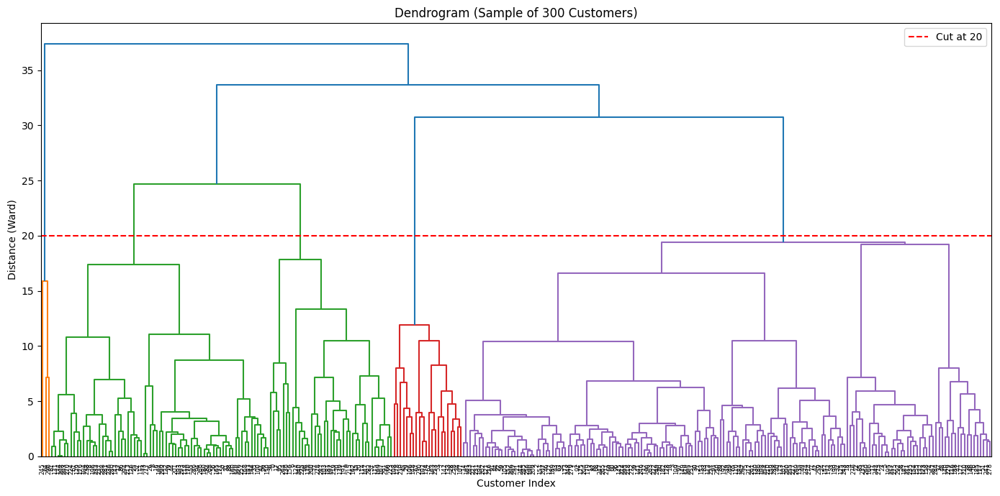

# Week 4 — Customer Segmentation with Clustering

## Project Overview
This project applies unsupervised learning to segment credit card customers into
meaningful behavioral groups, using data from ~9,000 active credit card holders over
a 6-month period. Unlike supervised learning tasks, there is no target label — the
goal is to discover natural groupings in customer behavior (spending, cash advance
usage, payment patterns) that a business could use for targeted marketing, risk
management, or personalized services.

Two clustering approaches are compared: **K-Means** and **Agglomerative Hierarchical
Clustering**.

## Dataset
- **Source:** [Credit Card Dataset for Clustering](https://www.kaggle.com/datasets/arjunbhasin2013/ccdata) (Kaggle)
- **Size:** 8,950 customers, 18 columns (17 features + `CUST_ID` identifier)
- **Features:** balance, purchase behavior (one-off vs. installment), cash advance
  usage, credit limit, payment history, and tenure

## Environment Setup
```bash
git clone <your-repo-url>
cd <repo-name>
pip install -r requirements.txt
jupyter notebook notebooks/week4_clustering.ipynb
```

**requirements.txt:**

pandas
numpy
scikit-learn
scipy
matplotlib
seaborn
jupyter


## Data Preprocessing
- Dropped `CUST_ID` , it's an identifier, not a behavioral feature.
- Handled missing values:
  - `CREDIT_LIMIT`: 1 missing value → row dropped (negligible impact on 8,950 rows).
  - `MINIMUM_PAYMENTS`: 313 missing values → imputed with the median, since the
    column is a skewed financial value and median is more robust to outliers than mean.
- Scaled all 17 features with `StandardScaler`. Scaling is mandatory here because
  K-Means uses Euclidean distance — without it, large-magnitude columns like
  `BALANCE` and `PAYMENTS` (values in the thousands) would dominate the distance
  calculation over frequency/ratio features like `PURCHASES_FREQUENCY` (0–1 range),
  even though the latter are just as informative for segmentation.

## Model Training & Evaluation

### K-Means
- Tested k=2 through k=10, recording inertia and silhouette score for each.
- **Elbow method:** inertia's rate of decrease slows most noticeably after k=4
  (drop of ~12,908 from k=3→4 vs. ~7,267 from k=4→5).
- **Silhouette score:** peaks sharply at k=3 (0.2506), dips at k=4–5, then climbs
  gradually toward k=9 without beating k=3, so the two methods don't fully agree.
- **Chosen k = 4** , supported by the elbow, silhouette still reasonable (0.1977)
  relative to the range, and produces enough distinct segments for meaningful
  business interpretation.
- Final cluster sizes: Cluster 0 (409), Cluster 1 (3,366), Cluster 2 (1,197),
  Cluster 3 (3,977).

### Hierarchical Clustering
- Ran on a random sample of 300 rows (full-dataset hierarchical clustering is
  computationally expensive) using Ward linkage.
- Dendrogram cut at distance=20, chosen by visually confirming it splits the tree
  into 4 branches, matching the K-Means k.
- Compared against K-Means labels (on the same 300-row sample) via crosstab: both
  methods agree well on the extremes (cash-advance-heavy customers, low-activity
  customers), but hierarchical clustering blurs the boundary between "regular
  transactors" and "low-activity" customers, and splits off a very small
  sub-cluster of premium spenders rather than keeping that segment intact.

## Results, Cluster Profiles (K-Means, k=4)
| Cluster | Size | Profile |
|---|---|---|
| 0 | 409 | **Premium spenders:** highest purchases, credit limit, payments; buys almost every month |
| 1 | 3,366 | **Regular transactors:** moderate spend, high purchase frequency, low cash advance use |
| 2 | 1,197 | **Cash advance users:** low purchases, but high cash advance amount/frequency; higher-risk segment |
| 3 | 3,977 | **Low-activity:** lowest activity across nearly every feature; largest group, re-engagement candidates |

See `notebooks/week4_clustering.ipynb` for the full elbow curve, silhouette plot,
cluster heatmap, and dendrogram.

## Conclusions
K-Means was chosen as the recommended approach for production use: it scales to the
full ~9,000 customers (hierarchical clustering only ran on a 300-row sample due to
cost), produces more consistent segment sizes, and is simpler to explain to
non-technical stakeholders like marketing or risk teams. Hierarchical clustering
remains useful for exploratory analysis, the dendrogram shows how sub-groups nest
and merge, but requires more manual interpretation to turn into business action.

## Screenshots
- 
- 
- 
- 